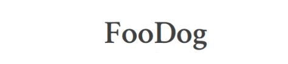

- Repository : `FooDog` 
- Temps nécessaire :  4 jours
- Travail : Groupe de 4  

## Formulaire de remise du projet

[Formulaire de remise]() __TODO__

## Objectif d'apprentissage

- Consolider ses connaissances en Bootstrap, Sass, CSS, HTML
- Respect d'un design

## Demande

Félicitations des clients ont regardé vos travaux de Star Wars et sont super impressionnés par votre niveau qui atteint des étoiles... 

L'un d'eux à un projet pour vous ! Lui, son truc ce ne sont pas les chats (comme nous), ce sont les chiens :dog:. 

Ce client voudrait accentuer sa présence sur internet via l'animation d'un blog, qui parle d'alimentation pour  chiens. Celui-ci s'appelle **FooDog**. Il a déjà un design à vous fournir.  

Vous allez devoir réaliser l'intégration du site. 

Vous réaliserez :
- 1 page d'accueil (suivant le design)
- 1 single pour les articles (suivant le design) : sur la front-page, mettez un lien qui renvoit vers cet article
- les autres pages: nutrition, wellness, lifestyle, community ne sont pas à réaliser mais doivent apparaître dans le menu. 

### Consignes

1. La charte graphique pour la version desktop devra être scrupuleusement respectée.  
1. Le site devra être responsive, une maquette pour le desktop est déjà faite mais vous devez concevoir vous-même une maquette pour la partie mobile. 
1. En tablet et mobile, il doit y avoir un menu hamburger.
1. Le site devra répondre aux normes [w3c](https://validator.w3.org/).
1. Intégrez-y un champs de recherche en haut à droite de la page sous forme d'une icône loupe (le designer a oublié de le mettre!). Pour la recheche, une fenêtre modale devra apparaître lorsqu'on l'on cliquera sur la loupe. 
1. Soyez attentif au référencement.
1. **PAS DE BUG**, tout doit fonctionner. 

#### Pour Github :

- Mettre le lien de la page GitHubPage à côté de la description (donc il faut une description au repo).
- Un readme qui décrit bien le projet --> [Ecrire un bon Readme](https://medium.com/becode/comment-faire-un-readme-sur-github-cc11f3df606a)

### Bonus 

1. Rajoutez des animations pour rendre le site plus vivant.

### Charte graphique

Le client a une idée très précise de ce qu'il souhaite. Il tient particulièrement au respect de la charte graphique qui se trouve ci-dessous.

**Polices utilisées**:
- [Crimson text](https://fonts.google.com/specimen/Crimson+Text) 
- [Open sans](https://fonts.google.com/specimen/Open+Sans)

**Les images**
- [unsplash](https://unsplash.com/search/photos/dog)
- [pexels](https://www.pexels.com/search/dog/)

**L'accueil** 

**La Single page** 

## Bonne chance  

[dog computer](https://media.giphy.com/media/mCRJDo24UvJMA/giphy.gif)