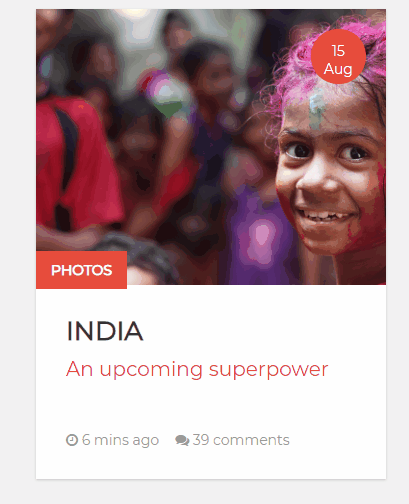
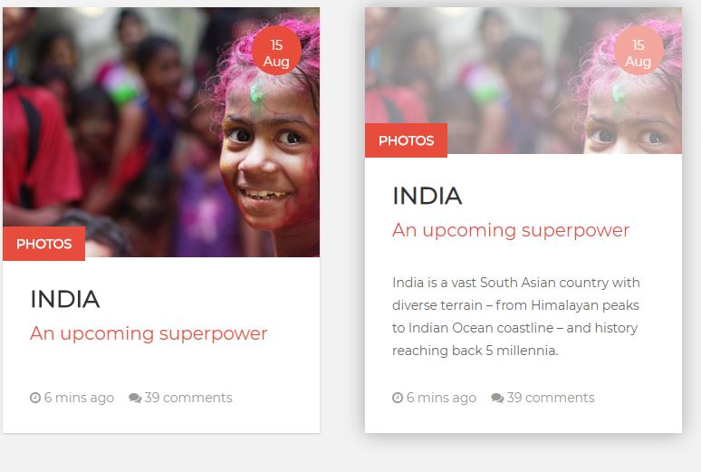

# Carte animée en CSS

Exercice à faire en ~~Han~~ solo  
Durée : **1 jour max !**

## Objectifs
* Devenir un jedi des animations css.
* Situer les animations dans un context réel

## Instructions :

* En SASS, tu coderas !  
Interdiction d'écrire dans ton fichier css.
* En anglais, tu nommeras !  
Il est important de bien nommer ses classes et de les nommer en anglais. Google trad est ton ami.
* Attentif, tu seras !  
Regarde bien tous les détails qui sont animés. Il y a la partie du dessous qui augmente en taille, un text qui apparaît, une ombre qui se forme, un zoom sur la photo, et un changement de couleur sur cette même photo. 

Voici les deux états différents. 

## Tu as terminé ?
Franchement bravo, tu possèdes déjà un sacré un bon niveaux en scss et css ! 

