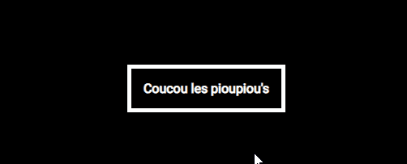
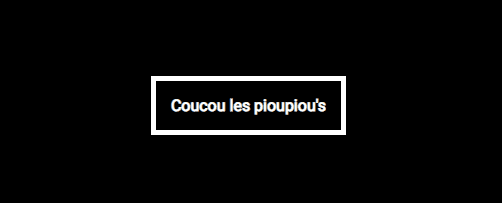

# Les animations CSS

Les animations servent à faire une transition entre deux états d'un élément. Si on prend l'exemple d'un bouton, il peut donc avoir deux états : l'état neutre/normal et celui qui est déclanché au survol de la souris  avec la *[pseudo-classe](https://developer.mozilla.org/fr/docs/Web/CSS/Pseudo-classes)* ``:hover``. Les animations ajoutent un peu de fluidité au changement d'état et dans ce contexte au changement de couleur du background et de la couleur du lien.

**Sans transition**  

**Avec transition**  

## Transition VS Animation
Il existe deux propriétés css pour faire des animations : ``transition`` et ``animation``.
Dans beaucoup de cas, vous allez utiliser la propriété ``transition``. Les transitions sont parfaites pour être employées lorsqu'il n'y a que deux étapes, de l'état neutre à l'état modifié et vice&versa. Si l'on reprend l'exemple du survol de la souris, la transition se fera automatiquement en mode "reverse", c'est à dire que le navigateur comprend qu'il doit faire une transistion à l'envers pour revenir à son état initial quand la souris ne survole plus le bouton. Autre différence les transitions ont besoin d'un élément déclencheur pour se lancer (le survol d'une souris donc+, l'utilisation du scroll, ...) à l'inverse de la propriété ``animation``. Donc si l'animation est complexe, ou qu'elle doit se déclencher toute seule, alors il faudra utiliser la propriété ``animation``. 

Voici quelques cas ou la propriété ``animation`` est plus indiquée. 
- Une Animation qui se répète.
- Une animation qui a plus de deux états/points intermédiaire. 
- Une animation qui démarre toute seule 
- Une animation où il y a une pause.
- Une animation avec des déplacements (changements d'états) complexes.

 ## Drill 

 **1. Reproduis cet exemple**  
   

 **2. Reproduis cet exemple sans modifier la valeur de la taille en largeur #DoNotTouchTheWidth**
    

 **3. Reproduis cet exemple sans modifier la marge #DontTouchTheMargin**
   

 Terminé ? OK, tu es prêts à passer [à l'étape suivante](menu.md)
