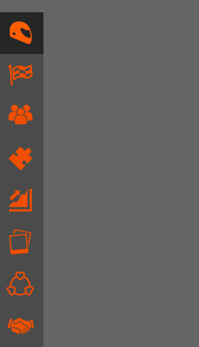

# Menu animé en CSS

Exercice à faire en solo  
Durée : **1/2 jour max !**

## Objectifs
* Apprendre à faire un menu animé.
* Situer les animations dans un context réel

## Instructions :

1. Les îcones utilisées ne doivent pas correspondre.  
1. Mais l'animation elle doit parfaitement correspondre. 
1. Soyez attentif, observez bien tous les détails et à quel moment ils changent d'état.

## Bon courage

Terminé ? Préviens ton coach !

