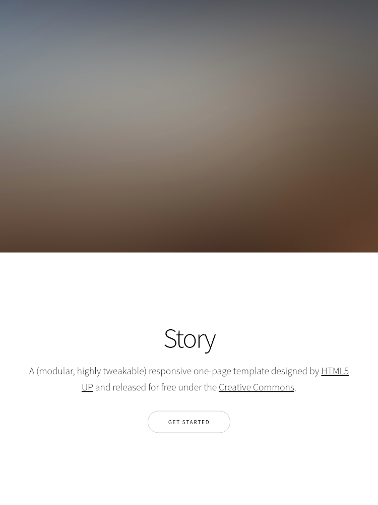
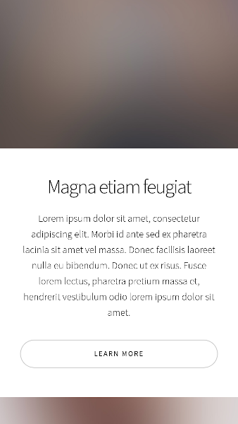
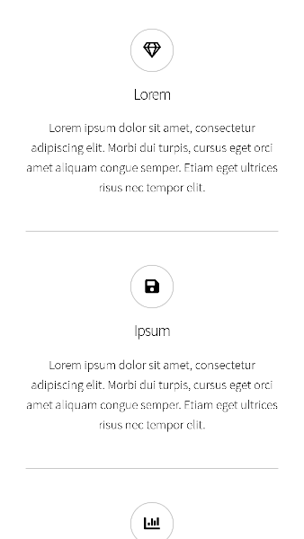
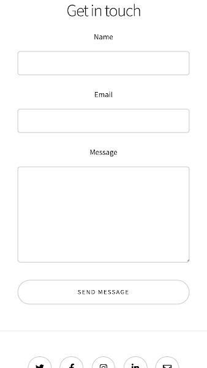

# Challenge des montagnes

Type de challenge : **Apprentissage**  
Durée: **1/2 jour**  
Team: **par 2**  

## Objectifs d'apprentissage

A la fin de ce challenge, tu devrais être capable de :

- Gérer un projet Github à plusieurs
- Utiliser les Dev Tools de ton navigateur pour voir comment un site est codé
- Utiliser des media queries pour créer un site responsive

## Le topo

Une association de fans d'alpinisme a développé un super site qui parle de leur passion. Mais il y a un petit problème, l'un des membres, développeur débutant n'arrive pas à rendre son site responsive. 

De plus, il a perdu les images et les seules qu'il avait en stock sont des images floutées. 

Ils ont fait appel à toi et un collègue pour effectuer cette mission.  

Pourrez-vous rendre leur site responsive ? 

## Instructions

Tu te trouves dans le dossier `montagne`, télécharges-le en local et crée un dossier `challenge-montagne`. 

Ensuite, créez un repo Github du même nom. Il ne doit y avoir qu'un repo par équipe. Celui qui crée le repo invite son partenaire. 

Regarde la structure du dossier.  

A la racine se trouve `index.html`. Regarde comment le html est construit. 

Dans `assets` --> `css`, tu trouveras le fichier `style.css`. Tu dois uniquement travailler dans ce fichier pour rendre le site responsive. Le style est déjà lié à `index.html`. 

Suis les layouts responsive ci-dessous. 
Il y aura 2 niveaux de responsive:
- pour les écrans jusque 768px
- pour les écrans jusque 576px

Pour les images, télécharges du contenu libre de droit sur un site comme [pexels.com](https://www.pexels.com). Prends des images de montagnes ou d'alpinistes. 

## Layouts

* Pour tablet 768px :

  
  

* Pour mobile 576px : 

  
  

## Encouragements 

Si vous réussissez, on pourra dire que vous avez atteint les sommets ! (oui, c'est nul, mais le gif est marrant...)

