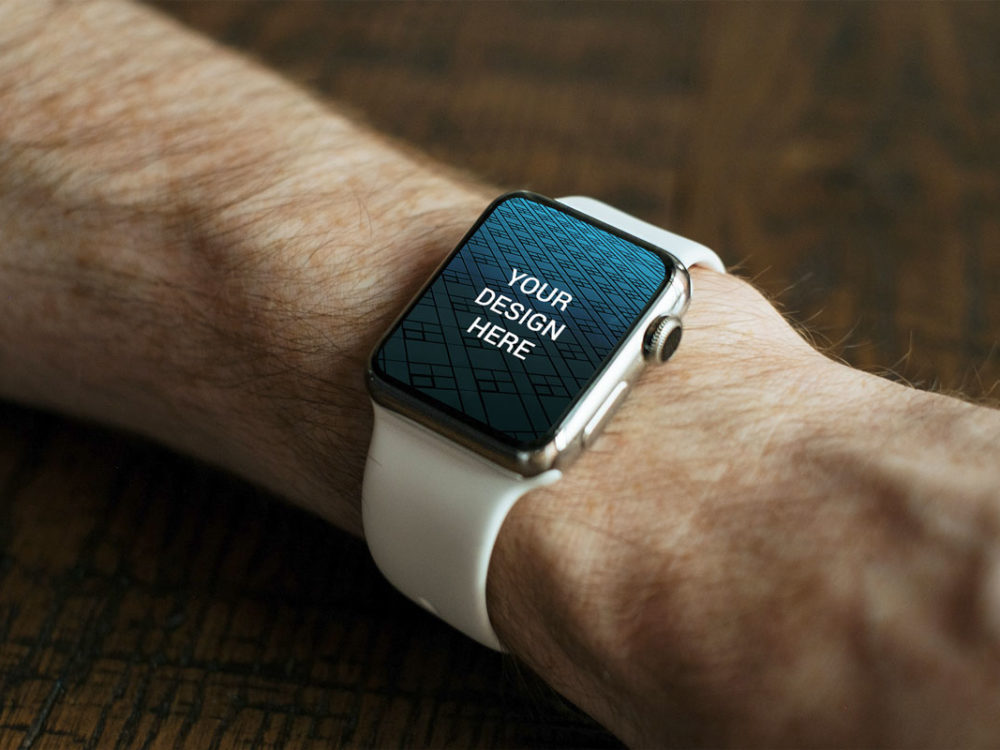

# Responsive Web Design

## La problématique

**Multiplicité des écrans**  
Aujourd'hui, un même contenu peut être vu sur une télévision HD, un laptop, une montre, un smartphone. Alors que faire ? Un développement par plateforme ? Faut-il faire X versions d'un même site, X étant le nombre total d'écrans de taille différente ?

La problématique est réellement advenue avec les premiers iphone en 2007 et puis s'est amplifiée exponentiellement.  Il a fallu du temps à l'industrie pour s'adapter et trouver la "bonne" approche. En 2010, le web designer [Ethan Marcotte](https://twitter.com/beep) introduit l'expression "Responsive Web Design" (ou RWA) dans cet article sur [A List Apart](http://alistapart.com/article/responsive-web-design).  

## La solution : CSS Media Queries
Via les Media Queries, on va pouvoir dire au navigateur : si ta taille est X, utilise ces propriétés CSS ci, sinon celles là. Le résultat attendu en terme d' UX est de ce style :   

Le RWD a entrainé une nouvelle manière d'envisager un site, différenciant de plus en plus entre la substance (le contenu) et l'apparence (le contenant : le device).

## A ton tour
1. [Apprends ici à les utiliser](https://www.w3schools.com/css/css_rwd_mediaqueries.asp).
2. Exécute ces quelques exercices pour les prendre en main

### 1. Changer la couleur
Crée un fichier html et un fichier CSS.
Fais en sorte que la couleur de fond du Body soit **rouge** lorsque la largeur du viewport est inférieure à 300px, **verte** lorsque la largeur du viewport est supérieure à 300px et inférieure à 768px, et **bleue** lorsque le viewport est supérieur à 768px.

### 2. Montrer / cacher des éléments
Rajoute trois `div`: une div avec l' id="small", une div avec l'id="medium", une div avec l'id = "large". Pour qu'on puisse les voir, dans chacune affiche le texte "Petit", "moyen" ou "grand".

Fais en sorte que n'apparaisse que la DIV concernée, en fonction de la largeur du viewport.

### 3. Adapter la taille du texte en fonction de l'appareil
Dans chaque DIV, ajoute un titre et quelques paragraphes (lorem ipsum, genre). Donne lui un texte descriptif (par exemple: "Contenu pour téléphones").
Adapte la taille de la police en fonction de la plateforme.

### 4. Adapter la disposition
Fais en sorte que :

- en petit, les 3 divs soient l'une en dessous de l'autre
- en moyen, la première fasse 2/3 de la largeur, la deuxième 1/3 et la troisième toute la largeur
- en grand, les 3 div soient l'une à côté de l'autre.

## Fini ? Bravo, ton contenu n'a qu'à bien se tenir !

### 5. Challenge

* [Challenge des montagnes](montagne)

