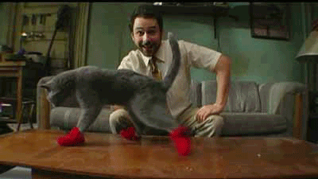

# Socket Gaming

  

## Goal of the project

* Learn to use Websockets through the usage of [Socket.io](https://socket.io/).
* Improve your knowledge of [Node.js](https://nodejs.org/en/).
* Learn how to make outstanding visual effects in frontends.
* Also improve your level at checkers...

## Description

Most (if not all) aspects of the project can be changed as long as your asks for approval from your coaches.

### The Game

[Checkers](https://fr.wikipedia.org/wiki/Dames)! If you would prefer to make another game you can ask your coaches. As long as it's not too simple (that would be too easy) or overly complex (you won't finish your game) they will probably agree. You can even make realtime video games if you want ! (like a space shooter or a platform game)

### How it should work

The program must use [WebSockets](https://developer.mozilla.org/en-US/docs/Web/API/WebSockets_API) (it is recommended to use [Socket.io](https://socket.io/) which is easy to use with Node.js) to make a multiplayer game.

The frontend part must be dynamic with animations when someone plays a move. It can be done using [React](https://reactjs.org/) but don't forget you'll need to use animations (just changing the placement of pieces from one frame to another is **not** sufficient). If you are adventurous we strongly encourage you to use more "video-gamy" librairies like [PixieJS](http://www.pixijs.com/), [three.js](https://threejs.org/),... that kind of things (just keep in mind it's super interesting but also quite challenging).

### Constraints

* **Have fun and challenge yourself**. You're making a video game, the thing that 95% of persons starting studies in computer programming dream to do, and that may be the one and only time someone asks you to do it.
* The delay after you play a move to see the change on another player's screen must be < 0.2 seconds.
* There must be **multiple rooms** (one server must allow multiple parties to run concurrently). You can take a look at Kahoot or multiple other similar projects to have and idea of how to do it.
* There must be animations for moves. (*Not just pieces disappearing and appearing from nowhere.*)
* Should you make a board game **all the rules must be completely implemented**. (See [here](https://fr.wikipedia.org/wiki/Dames#R%C3%A8gles_du_jeu_international) for checkers rules.)

## Example

* [OXONet](https://github.com/nicolas-van/oxonet)
