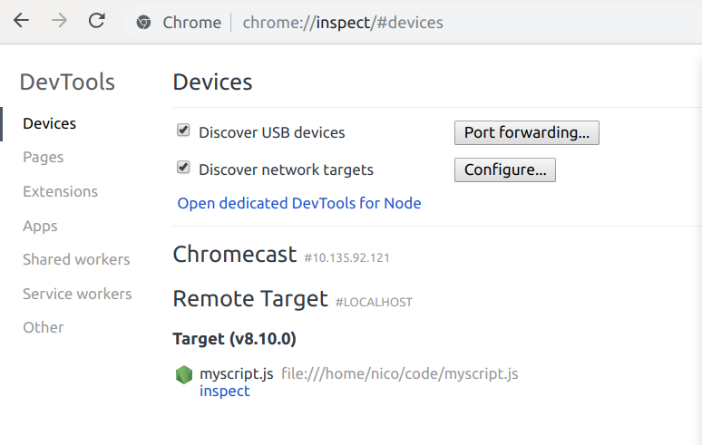

# Algorithmics with JavaScript Special 01 - Debugger

The purpose of this exercise is to learn how to use Google Chrome as a debugger for Node.js, as well as using a debugger in general.

## Launching Chrome debugger for Node

First take an already finished exercise, as example the 3.2.

Then launch it this way using Node.js:

```bash
node --inspect-brk myscript.js
```

Instead of executing your script normally Node will display something like this then do nothing:

```
Debugger listening on ws://127.0.0.1:9229/cce78ee2-f10c-4de4-9191-c7ec1a9592b5
For help see https://nodejs.org/en/docs/inspector
```

Next open Google Chrome and type the following URL in the URL bar: `chrome://inspect`. It should display a page like this one:



Click on the `inspect` button next to your script file name to launch the Chrome Debugger which is linked to Node.js executing your script.

## Exercise

Play around with the debugger. You can even re-launch your script to retry testing it. Be sure you tried at least once each of these:

1. The `Resume script execution` button.
1. The `Step over next function call` button.
1. The ability to display the variables with their values.
1. The console to display one of the variables.
1. The `debugger` keyword in your JavaScript file.
