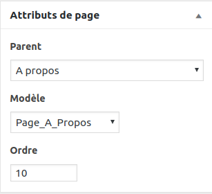

# Pages, Posts et Taxonomies

## Différence entre post et page

WordPress permet de créer deux types de contenus principaux, les posts (ou articles) et les pages.

- Les posts sont adaptés à du contenu posté régulièrement, ça correspond souvent à un fil d'actualité. Il y a une date, un auteur, on peut faire des commentaires. 
Pour les trier, on leur assigne souvent une catégorie.

- Les pages sont le contenu fixe de votre site. Par exemple, la page d'accueil, la page contact, la page de présenttion.
Les pages peuvent aussi avoir une hiérarchie, càd des sous-pages. Par exemple une page Nos spécialités peut contenir des souspages pizzas et pâtes. 

En savoir plus : https://wpmarmite.com/difference-article-page-wordpress/ 

## Organiser son contenu : sous-pages et taxonomies

Il est important de bien définir l'arborescence de votre site avant de commencer. 

Quelles sont les pages? Puis-je en regrouper certaines et décliner des sous-pages? Ai-je différent types de posts ou parlent-ils tous du même sujet ? 

L'arborescence définira aussi la construction de votre theme à travers les template php. 

### Taxonomies

Pour les articles, WordPress propose deux **taxonomies**: *catégorie* et *mot clé*.  

Les catégories sont hiérarchiques (on peut avoir des catégories, contenant des sous-catégories contenant des sous-sous-sous-catégories, etc.). En général, on considère qu'il ne faut classer ses articles que dans une seule catégorie.

Les mots clés par contre ne sont pas hiérarchiques et on considère qu'il vaut mieux associer à chaque article deux ou trois mots clés (et non un seul). 
Les mots clés permettent une navigation dans le contenu qui soit plus "transversale", alors que les catégories permettent une navigation plus structurée.  

On peut choisir les catégories d'un article dans un onglet à droite quand on édite un article. 

### Les sous-pages

Les pages s'organisent en *pages* et *sous-pages*. On parle de **relation hiérarchique** ou de relation *parent-enfant*.

On peut choisir une page parent dans l'onglet Attributs quand on édite une page. 

NB: Dans l'image ci-dessous, vous voyez l'option `Modèle`. J'y reviendrai dans le chapitre sur la [Hiérarchie des templates](01.hierarchy.md)

----

[05. Menu](05.navigation.md)
