# Découvertes de 2 plugins

Juste pour votre information, voici deux la présentation de deux plugins.

On va s'intéresser à **Contact Form 7** et **Elementor**.

## Contact Form 7

- Installez l'extension Contact Form 7

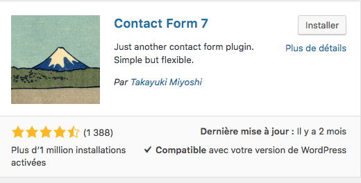

- Activez-le. Comme la plupart des extensions, vous pouvez remarquer que celle-ci s’ajoute sur la barre latérale gauche de votre Dashboard en tant que `Contact`.

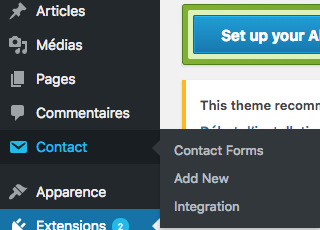

### Créez votre formulaire et l'intégrer à une page

 Créez un nouveau formulaire : L'onglet Contact / Add New et donnez lui un nom

 Avant de s’attaquer au formulaire, nous allons définir :

- Qui recevra une notification de nouveau message et comment personnaliser celui-ci ?
- Le type de message envoyé à l’utilisateur en fonction d’un événement spécifique (par exemple « si l’internaute ne remplit pas un champ obligatoire »)
- les réglages additionnels qu’il est possible de faire.

### L'onglet Form

Modifiez si vous voulez que votre formulaire soit en français

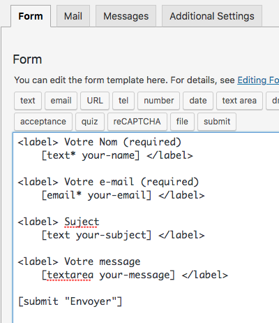

- Copiez le shorcode. C'est ce que l''on va coller dans la page pour "appeler" notre formulaire

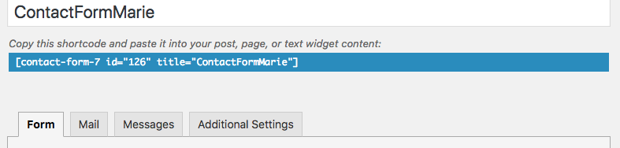

- Retournez sur Pages / Contact et collez le code.
 
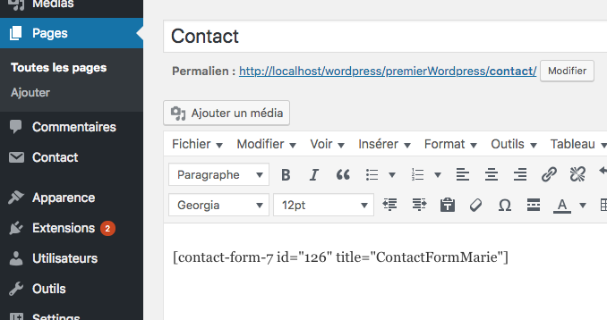

- N'oubliez pas de sauvegarder (mettre à jour)

### L'onglet Email

- `To` (Pour) : Le destinataire du mail. En général la vôtre ou celle de votre client.
- `From` (De) : Celui qui envoie le mail. Celui qui vous contacte
- `Subject` (Sujet) : Le sujet, le titre du mail
- `Additional Headers` (En-tête additionnels) : Ils permettent de mettre un ou plusierus de vos collaborateurs en copie de l'email que vous recevrez.
- `Cc` : Pour ajouter une personne en copie
- `Bcc` : Pour ajouter une personne en copie cachée
- `Message Body` (Corps du message) : Le contenu du mail. On peut simplement indiquer `[your-message]` puisque les informations du contact seront déjà dans les champs prédéfinis.
- `Exclude lines with blank mail-tags from output` (Exclure les lignes dont la balise d'email est vide)
- `Use HTML content type` (Envoyer cet email au format HTML). A prioori vous n'en aurez pas besoin

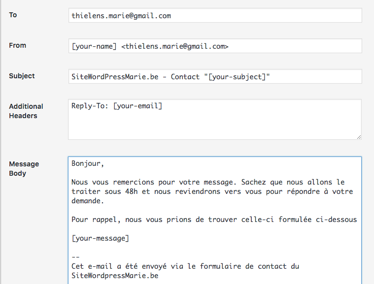

### L'onglet messages

Pöur définir quel message s'affichera en fonction d'évènements spécifiques. Par exemple un email mal renseigné, une url incohérente, le nom remplissage de champs obligatoires...

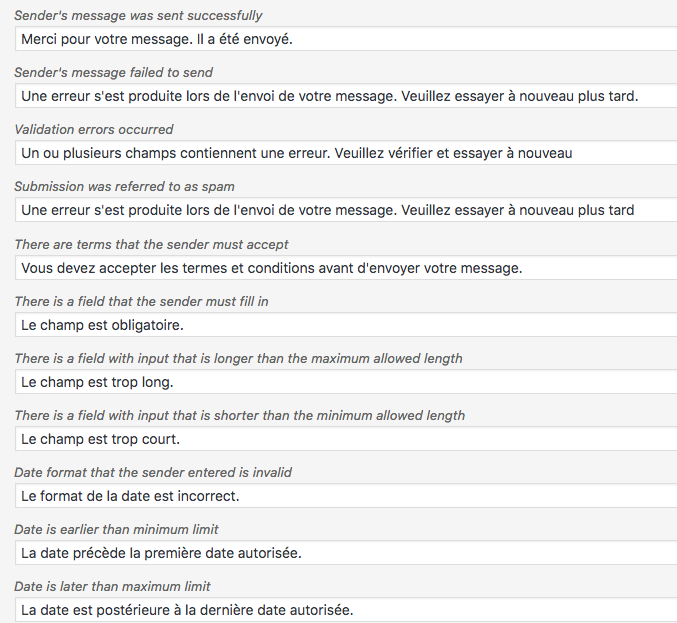

- Sauvegardez

### L'onglet Additional Settings (Réglages additionnels)

Les réglages additionnels permettent d’ajouter des éléments de personnalisation à votre formulaire. A titre d’exemple, si vous souhaitez que seules les personnes connectées puissent vous soumettre un message, c’est ici que vous le définissez.

Pour mieux comprendre les réglages que vous pouvez définir, je vous invite à consulter la documentation du plugin sur ce sujet à l’adresse : https://contactform7.com/additional-settings/

En savoir plus sur Contact Form 7 : https://wpformation.com/contact-form-7-tuto/

## Elementor

Le plugin Elementor permet d’ajouter un page builder dans n’importe quel thème. 

- Dans l'onglet plugins cliquez sur Ajouter
- Ecrivez Elementor et activez-le

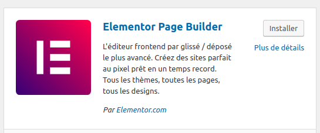

- Rendez-vous sur la `page Formations.` 
- Il faut d'abord configurer les attribut de la page pour que celle-ci suive un certain modèle. Dans ce cas, Elementor canevas. 
 Et mettre à jour pour sauvegarder.

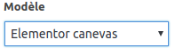

Vous remarquerez que le bouton modifier avec elementor est apparu : Cliquez dessus

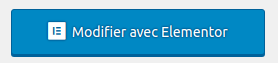

### Elementor Layout/ template tout fait pour vous 

Elementor vous permet de rajouter des layouts préconçus.   Nous en avons un qui ressemble à un cv de type classique. Allons voir ça. 
Pour se faire cliquez sur l'icone `dossier`

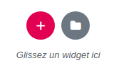

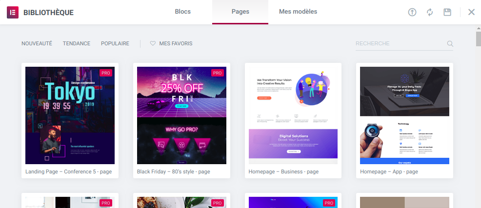

- Dans la barre de recherche mettez le mot clé `cv`. Vous n'aurez qu'une seule possibilité.

- Cliquez sur `insertions`
- Enregistrez en cliquant sur `mettre à jour`
- Allez voir le visuel de votre page. Le template est bien présent :) 

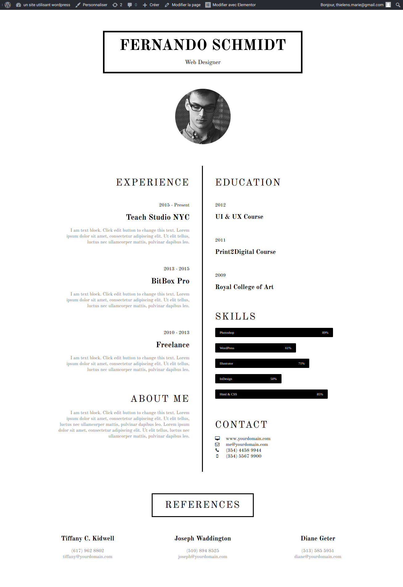

### Elementor : utiliser la grille et les widgets

- Rendez vous sur la page `projet`
- `Modifier avec Elementor`
- Changez le modèle pour `Elementor canvas`
- Cliquez sur le bouton `+`
- Sélectionnez votre structure. Imaginons que je voudrais présenter 3 projet que j'ai fait. J'aurai donc besoin de 3 colonnes..

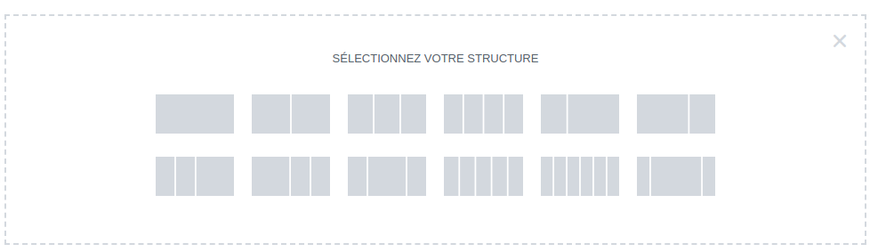

- Observez la colonne de gauche : vous avez des widgets que vous pouvez glisser/déposer.

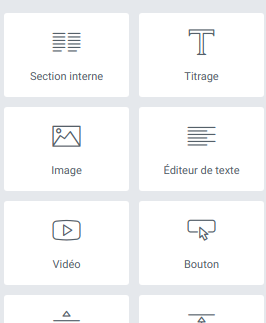

- Pour chaque projet j'aurai un titre (texte) et une image. 

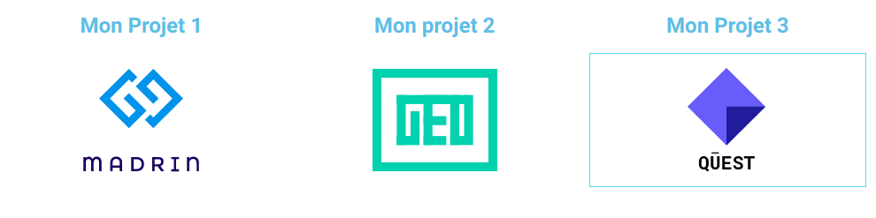

Simple non ? A vous d'utiliser elementor à votre guise ..

### Rajouter un plugin

Elementor ne permet pas de modifier le header et/ou le footer. Si vous souhaitez le faire il vous faudra rajouter l'extension suivante : 

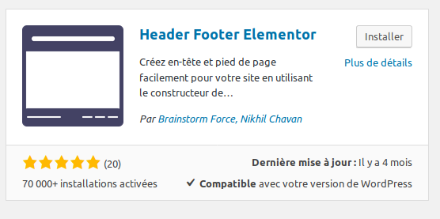

### Sources

- http://www.geekpress.fr/elementor-page-builder/

## Autres plugins à découvrir

25 autres plugins: https://wpchannel.com/wordpress/plugins-wordpress/25-plugins-wordpress-indispensables/ 

----

[07. Settings](07.settings.md)
