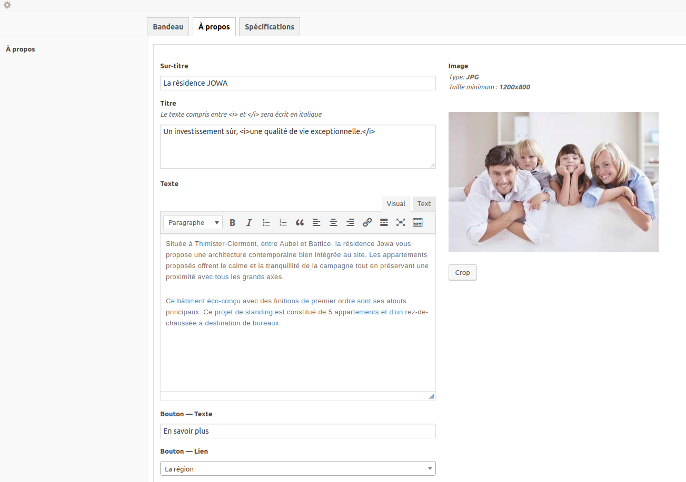

# Tutoriel ACF : création des champs 

Pour apprendre comment fonctionne ACF, nous allons prendre comme exemple la page d'accueil du projet CHIMMO. 

Voici comment se présentent les champs dans la partie CMS. 

NB: pour ce tutoriel, tous les champs seront désignés en anglais. 

#### Que voit-on ? 

Il y a 3 onglets pcq la page d'accueil est découpée 3 parties : 
- le bandeau supérieur
- À propos
- Spécifications

Nous allons nous concentrer sur le bandeau supérieur, créer tous les champs requis et faire en sorte qu'ils s'affichent comme sur l'image ci-dessus. 

## Le groupe de champs

Premièrement, rendez-vous sur le plugin.  
Ajoutez un nouveau type de champs. Nommez le *PAGE Accueil*

Vous voyez 3 parties : 
- La première sert à créer vos types de champs
- Location sert à déterminer sur quel type de contenu vos champs seront actif (pages, posts, catégories...)
- Settings permet de gérer des options pour l'affichage général

### Settings

On modifie deux choses dans les settings.  

Pour `label placement`, choisissez `left aligned`

Dans `Hide on screen`, cochez `Content editor` parce que sinon, un gros wysiwyg sera afficher par défaut au dessus de nos champs.  

En parlant d'éditeur de texte, nous devons enlever le nouveau super éditeur par défaut de Wordpress -> Gutenberg. Je vous renvois vers le chapitre [`02. Functions.php`](../02.Functions.md) pour pouvoir l'enlever. 

### Location 

Il faut spécifier sur quelles pages nos champs seront actifs. Ici il n'y en a qu'une, la page d'accueil. 

On sélectionne donc un type de page particulier, comme ceci. 

Il faut aussi que vous ayez bien définit la Homepage dans les options de votre site.

## Création des champs

Nous allons créer les champs proprement dits. 

Appuyez sur Add Field (Ajouter un champs)

1. Field label: ici mettez le nom du champs. Par exemple : "Bandeau"
2. Field name: c'est le nom du slug qui sera créé dans la DB. C'est ce nom qui nous permettra de récupérer la valeur du champs côté front. 
3. Field type: le type de champs. Vous pouvez voir toutes les possibilités dans le menu déroulant. Pour voir que ce que fait chaque champs et comment les utiliser, allez sur le site d'ACF. 

### Tab (Onglet)

Pour le premier champs, nous allons sélectionner `Tab` (`Onglet`).

Placement `Top aligned`.

Vous venez de créer le premier champs. 

À noter que pour les onglets, il y n'y a pas de slug, c'est simplement une mise en page pour bien séparer les sections. 

### Image

Complètez comme ceci,

- Field label: Image
- Field name: bandeau_image
- Field type: Image with user-crop
- Instructions: `Type: <b>JPG</b>   Taille minimum : <b>2600x1200</b>` (On peut donner des instructions au client pour lui dire quel type de fichier il peut uploader)
- Crop type: Hard crop
- Target size: ici vous voyez les tailles par défaut de Wordpress. Il faudrait créer un format de 2600x1200. Pour cela, vous devez ajouter un hook dans functions.php (mais je vous laisse chercher). 
- Return value: Image Array. Je privilégie toujours ce type de valeur, car c'est plus complet. On va voir plus tard comment récupérer cette valeur. 

C'est tout. 

### Titre

- Field label: Titre
- Field name: bandeau_titre
- Field type: Text

### Sous-titre

- Field label: Sous-titre
- Field name: bandeau_soustitre
- Field type: Text

### Bouton

- Field label: Bouton
- Field name: bouton
- Field type: Clone

Je m'arrête là. Nous allons créer un clone pour ce type de champs.  
Sauvergardez votre travail et retourner sur Custom Fields

### Clone

Un clone permet de créer un groupe de champs qui sera réutilisé plusieurs fois, dans plusieurs parties de votre CMS. Ca permet de gagner du temps pour ne pas devoir tout réécrire à chaque fois. 

Ici on va utiliser cette méthode pour créer un champs bouton.  
Le client CHIMMO aimerait avoir plusieurs possibilités pour ses boutons, soit y mettre un lien interne au site, soit un lien externe.  
On va lui permettre ce choix de possibilités. 

Voici la marche à suivre: 
- Créer un nouveau groupe de champs et nommez le *CLONE Bouton*
- Le premier champs à insérer est ´Group´, nommez le *bouton*
- A l'intérieur du `Group`, vous voyez la partie ´Sub fields´. Dans `Sub fields` vous pouvez insérer des sous-champs. 
- Créer les champs suivants : 
  - Titre :
    - Field label: Titre
    - Field name: title
    - Field type: text
  - Interne / externe :
    - Field label: Interne / externe
    - Field name: choice
    - Field type: Button Group
    - Choices: 
      - pagelink : interne
      - url : externe
  - Lien :
    - Field label: Lien
    - Field name: page_link
    - Field type: Page Link
    - Filter by Post Type: Page
    - Allow Archives URLs: Yes
    - Conditional Logic: Yes
      - Show this field if : Interne / externe -> Value is equal to -> interne  
   - Lien :
    - Field label: Lien
    - Field name: url
    - Field type: Url
    - Conditional Logic: Yes
      - Show this field if : Interne / externe -> Value is equal to -> externe
 
 Sauvegardez... 

 Nous avons fini ! Ca devrait ressembler à ça (avec les sub fields fermés) :
 
 

### Retour sur le Bouton

Ensuite, revenons dans le groupe *PAGE Accueil*, sur le champs *Bouton*.  

Il s'agit donc d'un champs `clone`.  

Dans Fields, il faut rechercher notre groupe CLONE Button. Sélectionnez `All fields from CLONE Button field group`.  

### Pastilles

Enfin, création de 2 éléments qui sont identiques. Pour une meilleure disposition pour le client, on va disposer les champs côte à côte, pour que ça donne ceci. 

- Field name: bandeau_past

Pour utiliser les colonnes, il faut créer un groupe. 

- Field Type: Group

Dans les Sub Fields, nous créons un champs `Column` -> Column Count: `One Half` 

Le champs suivant :

  - Field label: Pastille gauche
  - Field name: pastg
  - Field type: text

Répétez la même chose pour la 2e colonne. 

Voici à quoi ça doit ressembler :

## Les autres onglets

Nous avons écrit tous nos champs. Il reste maintenant à insérer le contenu. 

Je renvois à [la première image](#top) où nous voyons les champs complétés pour l'onglet `Bandeau`. 

En cadeau, je vous montre l'onglet `À propos`

et l'onglet `Spécifications`

Dans cette partie, vous voyez un groupe, séparé en 2 colonnes, dans lesquelles se trouvent des champs `Image`, `Text` et `Repeater` (`Liste`). 

Je vous laisse vous documenter sur le site d'[ACF](https://www.advancedcustomfields.com/resources/repeater/) pour voir comment fonctionnent les `Repeater`. 

___

[Vers Récupération dans les Templates](tutoriel2.md)