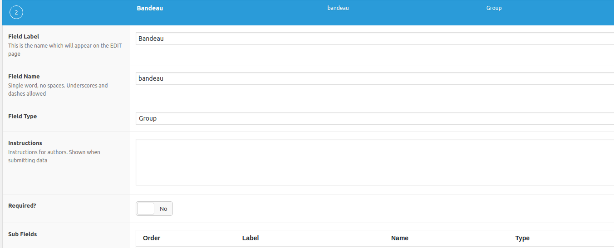

# Tutoriel ACF : création des champs 

Pour apprendre comment fonctionne ACF, nous allons prendre comme exemple la page d'accueil de votre projet COMPOSITION.

Allez sur le [projet Composition](../../projet) et regardez le design de la front-page. 

Voici comment pourraient se présenter les champs dans la partie CMS. 

#### Que voit-on ? 

Il y a 4 onglets pcq la page d'accueil est découpée 4 parties : 
- le bandeau supérieur
- Introduction
- Centre
- Inférieur

Nous allons nous concentrer sur le bandeau supérieur, créer tous les champs requis et faire en sorte qu'ils s'affichent comme sur l'image ci-dessus. 

NB: Comme nous utilisons des champs customisés, nous pouvons désactiver l'éditeur Gutenberg. Je vous renvois vers le chapitre [`02. Functions.php`](../02.Functions.md) pour pouvoir l'enlever.

## Le groupe de champs

Premièrement, rendez-vous sur le plugin ACF (ou Custom Fields).  
Ajoutez un nouveau type de champs. Nommez le *PAGE Accueil*

Vous voyez 3 grandes parties : 
- La première sert à créer vos types de champs
- Location sert à déterminer sur quel type de contenu vos champs seront actif (pages, posts, catégories...)
- Settings permet de gérer des options pour l'affichage général

### Settings

On va modifier deux choses dans les settings.  

Pour `label placement`, choisissez `left aligned`

Dans `Hide on screen`, cochez `Content editor` parce que sinon, un gros wysiwyg sera afficher par défaut au dessus de nos champs.  

### Location 

Il faut spécifier sur quelles pages nos champs seront actifs. Ici il n'y en a qu'une, la page d'accueil. 

On sélectionne donc un type de page particulier, comme ceci. 

NB: pensez à créer une page spécifique pour la front-page dans votre CMS. 

## Création des champs

Nous allons créer les champs proprement dits. 

Appuyez sur Add Field (Ajouter un champs)

Trois parties importantes :
1. Field label: ici mettez le nom du champs. Par exemple : "Bandeau"
2. Field name: c'est le nom du slug qui sera créé dans la DB. C'est ce nom qui nous permettra de récupérer la valeur du champs côté front. 
3. Field type: le type de champs. Vous pouvez voir toutes les possibilités dans le menu déroulant. Pour voir que ce que fait chaque champs et comment les utiliser, allez sur le site d'ACF. 

### Tab (Onglet)

Pour le premier champs, nous allons sélectionner `Tab` (`Onglet`).

Placement `Top aligned`.

Vous venez de créer le premier champs. 

À noter que pour les onglets, il y n'y a pas de slug, c'est simplement une mise en page pour bien séparer les sections. 

### Group : bandeau

Comme vous pouvez le voir sur le print screen du CMS. Vous avez 2 colonnes avec du contenu similaire :
- image
- titre
- survol
- bouton

Cette disposition reflète le design. 
Pour mettre les éléments en colonne, il faut d'abord créer un groupe.  
Dans Field Type, sélectionnez `Group`, comme ce ceci :

Vous remarquez qu'un champ `Group` contient des `Sub Fields`. C'est là, que nous allons insérer nos colonnes. 

### Colonnes

Dans le groupe nous allons insérer 2 colonnes. 
+ Add Field --> Column. 
Comme il y en a 2, mettez One Half dans `Column Count`. 

Sous les champs colonnes, nous pourrons insérer nos champs Image, Titre, Survol et Bouton. 

 Je vais vous montrer les champs à rentrer pour la colonne gauche. 

### Image

Complètez comme ceci,

- Field label: Image
- Field name: image_g
- Field type: Image with user-crop
- Instructions: `Type: <b>JPG</b>   Taille minimum : <b>1500x1250</b>` (On peut donner des instructions au client pour lui dire quel type de fichier il peut uploader et leur taille)
- Crop type: Hard crop
- Target size: ici vous voyez les tailles par défaut de Wordpress. Il faudrait créer un format de 1500x1250. Pour cela, vous devez ajouter un hook dans functions.php (mais je vous laisse chercher). 
- Return value: Image Array. Je privilégie toujours ce type de valeur, car c'est plus complet. On va voir plus tard comment récupérer cette valeur. 

C'est tout. 

### Titre

- Field label: Titre
- Field name: titre_g
- Field type: Text

### Survol

- Field label: Survol 
- Field name: survol_g
- Field type: Group

### Bouton

- Field label: Bouton
- Field name: bouton
- Field type: Group

Ce champs bouton est un groupe qui contient plusieurs sous-champs. 
Il y a un titre, puis un `Button Group`. 

#### Button Group

Ce Button Group vous permet de donner le choix à l'utilisateur de créer soit un lien interne, soit un lien externe.  

Voici la marche à suivre: 
   - Field label: Interne / externe
   - Field name: choice
   - Field type: Button Group
   - Choices: 
     - pagelink : interne
     - url : externe
  - Lien :
    - Field label: Lien
    - Field name: page_link
    - Field type: Page Link
    - Filter by Post Type: Page
    - Allow Archives URLs: Yes
    - Conditional Logic: Yes
      - Show this field if : Interne / externe -> Value is equal to -> interne  
  - Lien :
    - Field label: Lien
    - Field name: url
    - Field type: Url
    - Conditional Logic: Yes
      - Show this field if : Interne / externe -> Value is equal to -> externe

## Les autres onglets

Nous avons écrit tous nos champs. Il reste maintenant à insérer le contenu. 

Je renvois à [la première image](#top) où nous voyons les champs complétés pour l'onglet `Bandeau`. 

Pour les autres onglets, donc les autres parties de la front-page, je vous laisse gérer. 

Pour la suite, documentez-vous sur le site d'[ACF](https://www.advancedcustomfields.com/resources/repeater/) pour voir comment fonctionnent les autres champs. 

___

Si vous voulez voir comment récupérer les champs que nous avons créer ensemble, suivez le chemin --> [Vers Récupération dans les Templates](tutoriel2.md)
