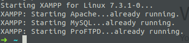

# Installation de WordPress et bases

## 1. Créer son environnement

Avant d'installer quoique ce soit, veillez à ce que votre Ubuntu soit à jour.

Pour utiliser Wordpress, il est recommandé d'installer un serveur HTTP Apache (ou Nginx). 
Vous devez également avoir PHP et MySQL.

Nous vous présentons ici 3 possibilités pour créer votre environnement. 

### 1.1. XAMPP

La façon la plus rapide pour créer son environnement est d'installer [XAMPP](https://www.apachefriends.org/download.html). 

XAMPP comprend également : 
- PhpMyAdmin, pour administrer ses bases de données
- Webalizer, le logiciel d’analyse de données
- OpenSSL
- ...

Une fois téléchargé, rendez vous dans votre dossier de téléchargement et tapez la commande pour lancer le package, par exemple :

  ```sudo chmod 755 xampp-linux-x64-7.2.18-1-installer.run```

Ensuite, pour lancer l'installateur : 

  ```sudo ./xampp-linux-x64-7.2.18-1-installer.run``` 
  
  Et c'est fait !  
  
  XAMPP a créé le répertoire ```/opt/lampp/htdocs``` 

Il reste à lui donner des droits en écriture :

  ```sudo chmod -R 755 /opt/lampp/htdocs```

Vous pouvez maintenant lancer votre serveur :

  ```sudo /opt/lampp/lampp start```



*Si erreur du type "Web server already running", vérifier ce qui tourne sur les Port 80 et 443.*

Pour ouvrir votre serveur local dans votre navigateur, rendez-vous ici : 

http://localhost

*Il s'agit ici de la config minimum. Pour configurer et sécuriser, je vous laisse vous renseigner*

### 1.2. LAMP

Si vous voulez tout configurer à la mano, optez pour [LAMP](https://www.digitalocean.com/community/tutorials/comment-installer-la-pile-linux-apache-mysql-php-lamp-sur-un-serveur-ubuntu-18-04-fr)

### 1.3. Docker

Il est possible également de travailler dans un container Docker comprenant Apache, MariaDB (MySQL compatible), PHP et phpMyAdmin. (merci à [Samuel Degueldre](https://github.com/sdegueldre)).  

[Installation docker compose](docker-compose/)


## 2. Installer WordPress

1. Téléchargez worpdpress sur le site officiel : https://fr.wordpress.org/download/ ou en Anglais : https://wordpress.org/download/ 

2. Décompressez le zip et mettez le dossier `ẁordpress` dans votre dossier htdocs (comme le fichier principal est un fichier php nous aurons besoin d’être dans htdocs pour que mon fichier soit interprété).

3. Renommez le dossier pour plus de compréhension, par exemple : `premierWordpress`


## 3. La base de données et wp-config.php

1. Avant de lancer wordpress il faut créer une base de données : créez une base de données sur http://localhost/phpmyadmin/ . (N’oubliez pas de lancer xampp au préalable)

- Nom de la base : nomDeVotreChoix ( `premierWordpress` )
- Interclassent : `utf8_unicode_ci`


2. Dans le dossier wordpress, ouvrez le fichier wp-config-sample.php et modifiez les informations de connexion

```php
// ** Réglages MySQL - Votre hébergeur doit vous fournir ces informations. ** //
/** Nom de la base de données de WordPress. */
define('DB_NAME', 'premierWordpress');

/** Utilisateur de la base de données MySQL. */
define('DB_USER', 'root');

/** Mot de passe de la base de données MySQL. */
define('DB_PASSWORD', '');

/** Pour permettre d'installer des plugins sur Linux */
define('FS_METHOD','direct');

```

3. Renommez le dossier wp-config-sample.php en wp-config.php
4. Lancez worpdress


## 3. Finir l'installation

Dans votre navigateur, mettez `localhost/premierWordpress`


C'est parti !

## 4. Saisir les informations pour lier wordpress à la base de données MySQL


Ici il s’agit de rentrer les informations de la base de donnée :

- Son nom : nom de la base de donnée 
- Identifiant (par défaut c’est root)
- Le mot de passe (par défaut c’est root)
- L’adresse de la base de donnée (là on travaille en localhost).
- Préfixe des tables : Je change son nom car c’est une pratique importante à prendre pour se protéger.

- validez.


## 5. Connexion à WordPress : allons voir la bête

Notez vos infos de connexion quelque part. On a vite fait d'oublier ...

-----

[02. La structure des dossiers et fichiers](02.structurefichiers.md)
