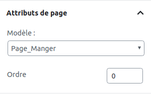

# La Hiérarchie des templates

## Introduction

[Explication dans le Codex](https://codex.wordpress.org/Theme_Development)

Il y a déjà beaucoup de thèmes existant alors pourquoi créer son propre thème ? Voici les avantages de créer son propre thème :

- C’est gratuit et si vous faites un thème de la mort qui tue, vous pouvez même le vendre. 
- C'est créer son propre univers, avec le look que l'on veut,
- d'un point de vue technique cela aide à l'apprentissage et la compréhension profonde de WordPress

Pour créer un thème, il faut commencer par ajouter un dossier avec le nom de votre thème dans le répertoire `wp-content/themes`.

Dans WordPress, un thème a une structure assez simple, car il ne nécessite qu'au minimum, trois fichiers !

`index.php`, `functions.php` et `style.css`

Pour pouvoir récupérer son thème dans le dashboard ajouter un `style.css` et mettez y les renseignements de votre thème. 

Exemple :

```
/*
Theme Name: premierWordpress
Description: premier wordpress des Jepsen
Author: Monsieur Jamar
Author URI: https://github.com/NicolasJamar
Version: 1.0
*/
```

Mise à part le fichier `style.css`, les autres fichiers seront des templates `php`

## Schéma des templates

Observez bien ce document: https://wphierarchy.com/

Ce sera votre guide pour la création de vos template `php`. 
Il vous aidera à comprendre le lien entre la partie back du CMS et le rendu front.

Voici la liste de tous les templates de base avec un site WordPress:
- index.php
- front-page.php
- home.php
- archive.php
- single.php
- page.php
- taxonomy.php
- category.php
- tag.php
- author.php
- date.php
- search.php
- 404.php


Pour bien comprendre la hiérarchie des templates sous WordPress, il suffit de suivre le chemin.  
  
En suivant https://wphierarchy.com/, tout à droite, vous voyez que tout template créé réfère à `index.php`. C’est le template de base, le fichier central. Ca veut dire que si un visiteur tente d'arriver directement sur la page d’un article (`single.php`) et que ce template n’existe pas, il sera directement renvoyé vers le fichier `index.php`. Ainsi, vous pourrez créer autant de templates que vous voudrez dans la liste proposée par ce schéma, il vont tous être sous la « responsabilité » de l’`index.php`.

Idem pour les niveaux au-dessus. Si vous avez un template `archive.php` et qu'un utilisateur tente d'arriver sur une catégorie spécifique (`category-slug.php`) qui n'existe plus, il sera rediriger vers `archive.php`. 

Encore un exemple, toujours en suivant https://wphierarchy.com/: 
- Vous avez créer un site qui parle de nourriture. Il y a une front-page avec des infos, des pages, un blog, des articles... 
- un utilisateur arrive sur la page d'accueil de votre site, le template correspondant est `front-page.php`, 
- ensuite, via le menu, il se rend sur la page "Que manger à midi?" -> `page-manger.php`
- puis sur cette page, un article est mis en avant (avec un titre et une image). Il parle des délicieuses "nouilles du Colruyt". l'utilisateur clique sur le lien pour voir l'article complet -> `single-pates.php`
- Ensuite, il veut voir tous les articles correspondant aux pâtes. Il y a un lien "Toutes les pâtes" -> `archive-pates.php` 
- il clique sur la catégorie "nouilles" -> `category-nouilles.php`
- si `category-nouilles.php` n'existe pas, il reviendra sur `archive-pates.php`

___

### Les slugs, id, modèle de page

Vous noterez dans l'exemple que j'utilise des termes pour désigner plus précisément les types de contenus (manger, pâtes, nouilles). 
Ce sont les **slugs** ou **posttypes** (pour pâtes). 

On peut également utiliser les **id**. Oui car derrière chaque élément créé dans WordPress, il y a un id correspondant.

**Le slug** ou l'id permet de cibler le template à atteindre. 

___

### Templates Page et Modèle de page

Je répète, **Le slug** ou l'id permet de cibler le template à atteindre. En effet, votre site peut avoir plusieurs types de pages (page "Que manger à midi?", page de contact, page "à propos" ...). Il faut les distinguer car elles sont différentes. Par exemple, la page contact contient un formulaire, mais pas la page "Que manger à midi?". 

Maintenant, admettons que j'ai une page "Que boire le soir?" dont la forme et le html ressemblent exactement à la page "Que manger à midi?", nous n'allons pas réinventer la roue, pas besoin de créer un nouveau template. Nous réutiliserons le fichier `page-manger.php`. 

En haut de ce template, nous noterons ceci :
```PHP
<?php
/*
Template Name: Page_Manger
*/
?>

```

Vous pourrez ensuite relier la page de votre choix à ce template de page dans la partie CMS. Dans notre exemple, les pages "Que manger à midi?" et "Que boire le soir?" auront le même template `page-manger.php`.


Voir Attributs 



___

### Template Single et Archive

Je reprends encore mon exemple. J'avais un post "Nouilles du Colruyt" créé à partir du template `single-pates.php`. 

#### Comment ça marche? 

Dans la partie CMS, j'ai créé un type de post "pâtes" avec l'aide du plugin CPT UI. 
J'aurais pu églament créer une fonction dans `functions.php`. 

```PHP
	function register_pates_post_type() {
	    register_post_type( 'pates', array(
	        'labels' => array(
	            'name' => 'Pâtes',
	            'singular_name' => 'Pâte',
	        ),
	        'public' => true,
	        'show_ui' => true,
	        'has_archive' => true,
	        'show_in_menu' => 'edit.php?post_type=pates',
	        'supports' => array( 'title' ,'thumbnail', 'editor' ),
	    ) );
	}
	add_action( 'init', 'register_pates_post_type' );
```

`(A noter que lorsque je modifie un élément dans Wordpress, j'appelle un hook, ici de type action)`

Un nouveau type de post apparaît dans le menu du dashboard, Pâtes. 

Si je clique dessus la liste des posts pâtes apparaît. 

Pour récupérer tout ces types de post sur une page, genre blog, je crée un template `archive-pates.php`

### header.php, footer.php, sidebar.php

`header.php`, ben c’est le header qui contient les informations de base qui vont permettre à la page web de bien s’afficher dans le navigateur. Le header comprend notamment:

- le DOCTYPE, qui nous fournit les informations sur le codage utilisé par la page web,
- la balise HEAD et tout ce qu’elle comporte: les balises META, le titre du blog, le lien vers la feuille de style et vers les flux RSS.
- L’ouverture de la balise BODY.

Exemple :

```html
<!DOCTYPE html>
<html <?php language_attributes(); ?>>

<head>
    <meta charset= "<?php bloginfo('charset'); ?>">
    <meta name="viewport" content="width=device-width, initial-scale=1.0">
    <meta http-equiv="X-UA-Compatible" content="ie=edge">
    <?php wp_head(); ?>
</head>

<body <?php body_class(); ?> >
    <h1><?php bloginfo('name'); ?></h1> 

```

On voit plusieurs functions spécifiques à Worpress. 

`wp_head();` désigne à Wordpress que c'est ici que ce trouve le header. 

Pour récupérer le header dans chaque page et post, on mettra `get_header();`

Ca fonctionne de la même manière pour le footer.

Pour la sidebar bar, pas besoin du wp_sidebar, mettez directement `<?php get_sidebar(); ?>` sur le côté par exemple (logique). 


-----

[02. Functions.php](02.Functions.md)
