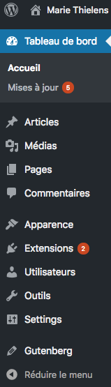

# Le dashboard

Une fois que vous avez entré vos identifiants, vous arrivez sur l’interface d’accueil de WordPress appelée `Dashboard` ou `Tableau de bord` . C’est la page d’accueil de WordPress qui va vous permettre en un coup d’oeil de connaître l’activité récente de votre site. A partir de là,vous pourrez gérer intégralement le contenu de votre site.
 
## La barre latérale

La barre latérale de WordPress est le menu de navigation de l’administration. Il reprend les différentes fonctionnalités qui vont vous permettre d’effectuer des actions. Lorsque vous cliquez sur un menu, il s’ouvrira pour faire apparaitre d’autres fonctionnalités qui lui sont dépendants.

Par défaut, les menus sont les suivants :

- Tableau de bord
- Articles
- Médias
- Pages
- Commentaires
- Apparence
- Extensions
- Utilisateurs
- Outils
- Réglages

Ce menu peut-être différent selon les sites, vous pouvez en avoir en plus si vous avez des plugins installés sur votre WordPress.

Vous pouvez également réorganiser ce menu en utilisant des [hooks](https://code.tutsplus.com/articles/customizing-your-wordpress-admin--wp-24941).

## Changer de thème

Allez dans Appaerance -> Themes 

Pour changer de thèmes, cliquez sur Activate. 

Vous pouvez également cliquer sur `Add` pour télécharger un thème. 

Si vous enlevez du menu la possibilité de changer de theme (pour empêcher qu'un client ne le fasse par exemple), vous pouvez toujours y accéder via le template theme.php : `http://localhost/premierWordpress/wp-admin/themes.php`

----

[04. Pages, Posts, Taxonomies: organiser son site](04.Pages.md)