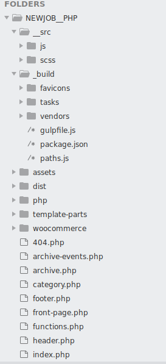

# Organisation de votre thème

J'ai déjà parlé de l'arborescence de votre site et de ne pas répéter vos templates. 

Maintenant, je vous donne un conseil d'organisation avant de commencer un projet concret. 

Dans le root de votre thème, ne laissez que les templates de base : front-page.php, footer.php, page-contact.php, single.php ect...

Vous pouvez créer autant de dossier que vous voulez pour mettre en place votre propre structure. 

Par exemple, créez un dossier `template-parts` pour mettre les bouts de code php tel des lightboxes, des logo en svg, un petit menu... 

Ou encore créer un dossier pour y metter tous vos hooks de customisation, car il peut y en avoir beaucoup et vous serez vite perdu dans le simple `functions.php`. 

Enfin, il y a toute l'infrastructure JS ou Sass à mettre en place. 

Voici un exemple de structure :

----

Je crois que maintenant vous savez pas mal de choses, il ne reste plus qu'à passer à la pratique !

[ACF](../ACF/)
