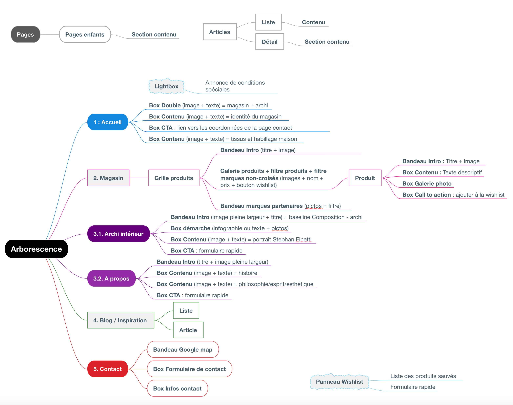

# Projet - COMPOSITION

- Repository : `cms-composition`
- Deadline : 28/10/2019 08:59:59
- Team : group of 4

## Objectifs

- Créer un site web à l'aide d'un CMS
- Créer une belle interface client avec des champs customisés
- Respecter un design au pixel près

## Présentation

Composition est une société d'architecte d'intérieur et de vente de meubles design. Ils excellent dans leur domaine, "L'esthétique comme horizon" est leur adage. 

En accord avec cette idée, ce client a entrepris de rafraîchir son site vieillissant. Pour ce faire, il a contacté René Binamé, un project manager et designer. Après des semaines de boulot, ils ont défini et dessiné les contours de ce futur site web.

C'est à ce moment que vous intervenez. En effet, René contacte votre équipe pour réaliser le projet. Il vous fournit de magnifiques layouts et des instructions très précises.  

## Demande

Le client souhaite pouvoir éditer le contenu de son site régulièrement. C'est pourquoi un CMS est la meilleure solution que vous pouvez lui fournir. 

Peu importe le CMS utilisé, tant que l'interface utilisateur est facile à comprendre et les champs à remplir sont clairs.  

Vu son exigence envers le design, le client souhaite que vous respectiez **scrupuleusement** ce qui a été dessiné par René Binamé.

## Ressources

Toutes les pages dans les différents formats, ainsi que les images découpées sont dans le dossier [assets](./assets/)

### Design

Les design fournis sont en mode Desktop, Tablet portrait (768px) et Mobile. 

___

## Instructions

Voici la liste des instructions reçues. 

Elles désignent les types de contenu (page, post, catégorie), ainsi que les champs customisés à créer. 

### Arborescence

Tout d'abord, René nous a transmis l'arborescence du site. C'est une bonne base pour voir comment construire vos templates. 

Je vous demanderais cependant de ne pas regarder la partie "Magasin". La réalisation de cette partie constitue un bonus. 

### INFOS

Prévoyez un groupe de champs pour que le client puisse rentrer les infos de l'entreprise. 

- L'adresse
- Téléphone
- email
- Horaires d'ouverture
- Lien Google maps
- Liens réseaux sociaux : Facebook, Instagram, Pinterest

Certaines de ces infos sont reprises dans le footer et dans la page contact. Faites en sorte que le client ne remplisse qu'une fois ces champs. 

### PAGE ACCUEIL

Pour la page d'accueil, si vous avez fait le [tuto du parcours Wordpress](../parcours/ACF), vous avez déjà le bandeau supérieur. 

**Custom fields :**

	*** Bandeau  ***
		2 x Img + Titre + Hover : Titre + txt + Lien interne 
	*** Intro ***
		Txt + Titre + wysiwyg + lien interne ("Le magasin") + Img
	*** Milieu ***
		Txt + lien interne ("Services d’archi d’intérieur")
	*** Tissus ***
		Img + Titre + Wysiwyg + lien interne ("Tapisserie d’ameublement")

**Niveau Wordpress, c'est le template `front-page.php`**

Petit truc, il y a un 2 design pour la front-page car il y a un effet hover sur deux blocs chevauchants les images du top. 

Font bandeau :
- titres : 24px light
- textes : 16px light
- liens : 18px bold

### PAGE ARCHITECTE D'INTERIEUR

**Custom fields :**

	*** Diaporama ***
		= Posts Projets
	*** Etude d’archi ***
		Titre + Ss-Titre + Wysiwyg + Repeater (txt)
	*** Nghi & Stephan ***
		Titre + Ss-Titre + Wysiwyg
	*** Tissus et artisanat***
		Repeater img (diaporama)
		Titre + Ss-Titre + Wysiwyg

### PAGE A PROPOS

**Custom fields :**

	*** Diaporama ***
		Repeater img
	*** Histoire ***
		Titre + Ss-Titre + Wysiwyg + Repeater (Année + txt)
	*** Caractère ***
		Titre + Ss-Titre + Wysiwyg

### PAGE CONTACT

Créez un formulaire de contact fonctionnel. 

**Niveau Wordpress, créez un template `page-contact.php`**

**La carte:**

Essayez d'intégrer une carte OpenStreetMap (parce que c'est gratuit) avec le design en ton de gris, tel que proposé. 

Mettez-y l'icone svg.

### POSTS NEWS

Ici, on demande, notamment, de créer un contenu Flexible, qui permet au client de changer la disposition du contenu dans son CMS via un drag & drop. 

ACF Pro permet d'implémenter facilement ce genre de contenu.  

	*** Contenu ***
		Titre + Img + Intro 
		Flexibles :
			- Titre
			- Wysiwyg
			- Img

Sur le design, on voit également la date de publication du post, pas besoin de créer un champs customisés, ça doit être la date fournie automatiquement par le CMS. 

### POSTS PROJETS (= design posts news)

	*** Contenu ***
		Titre + Img + Intro 
		Flexibles :
			- Titre 
			- Wysiwyg
			- Img

### ARCHIVE POSTS NEWS

Dans le design, vous voyez une liste avec toutes les 6 dernières news.

Il faut pas créer de champs supplémentaires. Reprenez le titre et la date du post. 

Par contre, il y aura plus que 6 news. Il faudra créer un système de pagination. Malheureusement, le designer a oublié de le mettre. 

Placez un système de pagination en dessous des 6 posts. 

Tips : créez au moins 7 posts pour voir si votre système de pagination fonctionne. 

NB : il n'y pas d'archive pour les posts Projets mais il y a bien des singles. 

### BANDEAU MIS EN AVANT

Il y a un bandeau qui apparaîtra sur plusieurs pages (mais pas la page d'accueil). Il porte le titre "Je souhaite connaître les conditions" sur le design. 

	*** Bandeau CTA News  ***
			Img + Titre + Lien interne

### BONUS

Le client aimerait avoir une partie e-commerce à son site, mais il doit voir s'il a le budget pour nous demander ce service supplémentaire. 

En effet, en tant que développeurs voulant atteindre l'excellence, vos tarifs sont déjà très élevés.

## Déployement

Vous ne devez pas déployer ce site. Si malgré tout, vous voulez le faire, il n'y a pas de soucis, mais faites en sorte qu'il soit invisible pour les moteurs de recherche. 

## Conseils

- Comme vous allez travailler en groupe, faites attention pour gérer la DB. Echangez la dernière version régulièrement.
- Bien structurer votre HTML. 
- Quand vous faites le css, pensez à zoomer et dézoomer pour voir si les éléments sont bien disposés. 
- Amusez-vous bien !

 

## Charte des couleurs

- blanc :#FFF
- noir : #000

## Font

Tous les textes sont en font Proxima Nova. 

Il y a beaucoup de tailles de font différentes. Faites sorte que ça ressemble au design, mais ne vous prenez pas trop la tête pour ça. 

Voici tout de même quelques indications :

- Texte normal :
	- font-size: 16px
	- font-weigth: light
- Menu :
	- font-size: 14px
	- font-weigth: bold
- Liens/boutons : 
	- font-size: 18px
	- font-weigth: bold
- Titre post :
	- font-size: 40px
	- font-weigth: bold
- Date post :
	- font-size: 16px
	- font-weigth: medium
