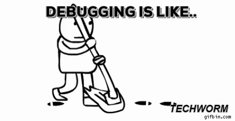

# Debugging

- Repository: `php-debugging`
- Type of Challenge: `Learning challenge`
- Duration: `1 day`
- Team challenge : `solo`

## Learning objectives
- understanding the root of bug fixing
- know what print_r, var_dump, die, echo, exit, break do
- know what to do the next time you're stuck
- give yourself the `solver's mentality`, a problem is just an opportunity to learn!

## The point
Debugging is the pinpoint to being a master in any coding language.  
Everyone gets errors, but the best programmers never let it stop them and they find a way to fix it every time!
In order to debug a program in PHP, you can use this guide: [The guide](https://rollbar.com/guides/how-to-debug-php/)

Discover, look up, research whatever ways work for you to debug you code!

**I very much encourage you to use xDebug as much as possible!**

## The job
Open up the [junior.php.broken](resources/junior.php.broken) file, read the comments, fix the code blocks as requested in the comments
and put the final file [expert.php](resources/expert.php) in the repository folder as requested.

You will change this junior code in expert code!

