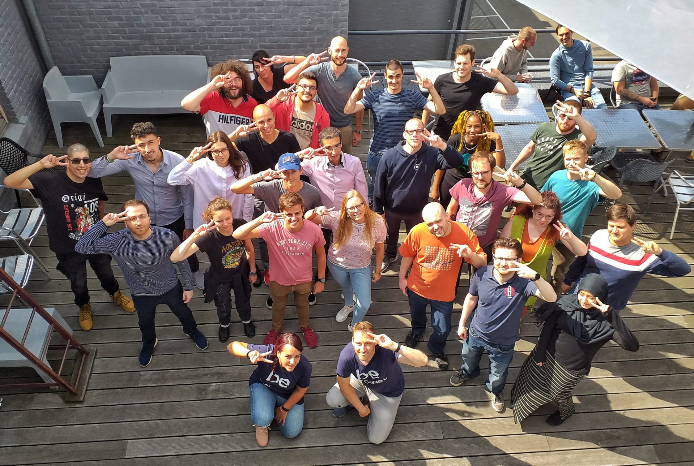

# Startup Jepsen 2.14

Ce repo est pour tout ce qui concerne ton activité à BeCode : briefings, parcours, etc.
Clone-le sur ton ordi et `git pull` régulièrement afin de rapatrier les mises à jour.

#### Ouais, mais moi, j'ai fait un fork !

Tu as forké ce repo ? C'est bien aussi.

Le truc, c'est que ton _fork_ est **indépendant** de sa source : si on fait des mises à jour ici, tu ne les verras pas sur ton fork.
C'est embêtant, mais pas de panique, git a une solution pour tout !

Dans ton terminal, navigue jusqu'au clone de ton fork, et entre la commande suivante :

    git remote add upstream https://github.com/becodeorg/LIE-Jepsen-2.14.git

Si tout s'est bien passé, la commande `git remote -v` devrait te retourner quatre lignes : deux pour `origin` (ton fork), deux pour `upstream` (le repo de référence).
Une fois ça fait, à chaque fois que tu voudras _synchroniser_ ton fork avec le repo de référence, il te suffira d'utiliser la commande suivante :

    git pull upstream master

## Tes sources d'information pour respecter les règles de BeCode

1. Lis le [contrat pédagogique](../../../BeCode/blob/master/contratpedagogique.md).
1. Le [Wiki de BeCode](https://github.com/becodeorg/BeCode/wiki)
1. [L'agenda de ta startup](https://calendar.google.com/calendar/b/1?cid=YmVjb2RlLm9yZ19wNTc0YXFsZGhnYzNrOWwyaXBqaThwb21hb0Bncm91cC5jYWxlbmRhci5nb29nbGUuY29t)
1. [Becode Liège](/infos/)

## Retards et absences

En cas de retard, d'absence ou de départ anticipé (que ça soit prévu ou pas du tout), préviens-nous !  

Dans l'ordre :
- Tu envoies un email à tes coachs, rédigé professionnellement à nico@becode.org et julie@becode.org.
- Document justificatif: télécharges-le directement sur [my.becode.org](https://my.becode.org), si possible, sinon envoie-le dès que tu l'as reçu. [[Mode d'emploi My Becode](https://github.com/becodeorg/BeCode/blob/master/mybecode-absence-fr.md)]
- Pas de justificatif ? Dis-le à tes coachs explicitement.

[Petit rappel](https://github.com/becodeorg/BeCode/blob/master/contratpedagogique.md#sanctions) :
- 2 retards non justifiés seront comptabilisés comme une absence ;
- 2 absences entraîneront une convocation en entretien individuel ;
- 6 absences non justifiées entraîneront une exclusion définitive ;
- Si le taux d'absence (justifiées ou non) dépasse 20%, BeCode pourra décider de l'exclusion définitive de l'apprenant(e).

## Contenus pédagogiques

[Le parcours pédagogique](https://docs.google.com/drawings/d/1Rk-CRGgT3S3CwWI9-OSG_-qODqnzDu3rVFOglPBPhP0/)

1. [La prairie](./01-the-field/)
2. [La colline](./02-the-hill/)
3. [La montagne](./03-the-mountain/)
4. [Les pâturages](./04-the-pastures/)

## Congés
| Dates | Pourquoi on n'est pas là ? |
|---|---|
| Semaine du 14 au 18 octobre | on se repose |
| Ve 01 novembre | Toussaint |
| Lu 11 novembre | Commémoration du 11 novembre |
| Semaine du 23 au 27 décembre | Vacances d'hiver (Noël)|
| Me 1 janvier 2020 | Jour de l'an |
